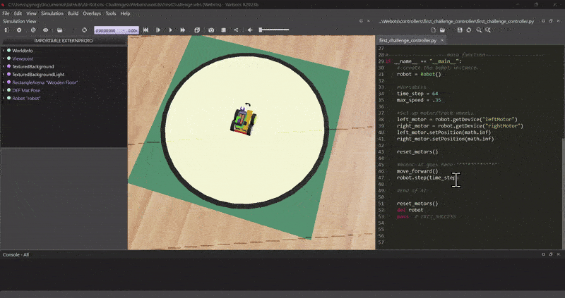

## About This GitHub
This is a CS capstone project made for the AI class at Bradley University. This GitHub should help students use Webots to test their algorithms in a virtual simulation before testing in real life.

To see more details on how to use Webots, expand one of the following pages.

<details>
 <summary>Webots Setup</summary>
  <ol>
   

 ## GitHub Setup
 
This GitHub is public read-only, meaning any changes will be saved locally. If you don't want a backup, clone this GitHub to your device by downloading or cloning it to GitHub desktop. If you want backups of your files, such as your robot algorithm/code, through Github, you will need to fork this repository as follows:
 
 * In the top right corner of this GitHub, hit the fork button
 * Scroll down and click "Create Fork"
 * When the repository is completed, clone the forked repository to your device


## Webots Setup

Go to the Webot's website [https://cyberbotics.com/](https://cyberbotics.com/) and click the download button.


If you aren't on Windows, click the arrow next to the download button to specify your operating system for the correct installer.


* Run the installer you just downloaded
  * On Windows you'll get the dialogue warning, "Windows protected your PC" prompt. Select, "More info," and then click, "Run anyway"
* Follow the install wizard dialogues and installations and you have finished setting up Webots!
<br />

If you have trouble installing Webots, contact your professor for additional resources.


## Understanding Webots

Let's start by opening a Webots world simulation.

* In the file explorer, open up the file from this GitHub at, "...AI-Robots-Challenges\Webots\worlds\moose_demo.wbt"
* When opening Webots for the first time, choose which theme you like and then press, "Start Webots with the selected theme"
* Close out of the guided tutorial window to continue
<br />

This 'world' you opened up is one of Webot's open source demo worlds. Here, the robot demonstates simple movement ai that traverses between defined checkpoints. You may explore the enviornment by moving the scene camera.

* To rotate the camera, hold left-click while moving your mouse inside the simulation window
* To move the camera, hold right-click while moving your mouse inside the simulation window
<br />

Now that we have the hang of moving the camera, let's look at other ways to control the simulation.

* Above the simulation window, you'll find the main functions for the simulation, tooltip information is displayed when hovered over the different functions
* The 'pause/play' function starts or pauses the current world simulation
* To the left of that, the '|<<' function resets the time of the simulation to 0
  * Pausing the simulation before resetting will keep the simulation in a paused state after resetting
<br />


The left side of the interface contains the hierarchy of objects/nodes, and the right side contains the built in text editor section where you can edit scripts inside the program. These functionalities and how to use them will be covered more in further sections.


---

 </ol>
</details>


<details>
  <summary>First Challenge</summary>
  <ol>

## Open Webots

You will be coding the first challenge (Hysteresis/Week 10) in the virtual world.

* In the file explorer, open up the world file at, "...AI-Robots-Challenges\Webots\worlds\FirstChallenge.wbt"

## Understanding Nodes (Optional)

To understand how Webots works, understanding the node system is essential. Nodes are shown in the left window, which behave as objects as well as variables. To understand them better, let's make a simple box.


* While not within an expanded object/node in the object/node hierarchy, click the add node button '(+)' in the top left of the interface
* Inside the 'Base nodes' dropdown, select 'Solid' and then click 'Add'
* Expand then dropdown of the created Solid object, select the 'children' parameter or right-click on the Solid and select 'Add New'
* Inside the 'Base nodes' dropdown, select 'Shape' and then click 'Add'
<br />

Objects, such as robots and and other geometric shapes are nodes. The children of those nodes are the properties of their parent node. Now that we have a solid object, let's specify its shape by changing the properties.


* Inside the Shape dropdown, add a node to the 'geometry' parameter by double-clicking the parameter name, and then selecting 'Box' under the 'Base nodes' dropdown before clicking 'Add'
* Inside the geometry parameter which now displays 'geometry Box', select the 'size' field from the dropdown and set the size values to '0.25' for the x, y, and z vector variables
* Now go back and set the 'appearance' variable, again by double-clicking the parameter name and selecting either 'Appearance' under the 'Base nodes' dropdown. 'PBRAppearance' is very similar but with a few different functionalities, it comes down to preference of whichever you prefer, but we will be going over using the basic 'Appearance' option
* Inside the appearance dropdown, double-click the parameter name to select the 'Material' node and then 'Add'
* Inside the 'material Material' dropdown, change the diffuse color to whichever color you'd like by manually changing RGB values or by using the color picker
<br />

By making this cube, you should have a better understanding of Webots' node system (sub-nodes, variables, etc). There is more to physically simulating this object (adding physics and specifying the bounding object as a box), so if you are interested, check the 'Additional Resources' page of this ReadMe. If you haven't saved the simulation, using the above reset button '|<<' will return to the last checkpoint before having created the box object.


## Coding the Robot

Let's start coding using the built-in IDE on the right-side of the interface.

Webots programming works by getting a reference to each motor through code and then telling it what to do. Those motors will continuously do that task until given a new command. Webots lets you wait time as a function in the code, so you don't need to tell the motor what you want it to do constantly.

If you look at the code, you can see the functions 'move_forward()', 'move_back()', 'turn_left()', and 'turn_right()', which tell the motors how to rotate. Let's use these functions to write a robot that moves forward, the code for this AI starts on line 45.

* On line 47, the robot only waits one step, which isn't enough to move forward. Let's change that to 10 steps by changing the line to
```sh
robot.step(time_step * 10)
```
* Save the code by pressing Ctr+S or hitting the save button at the top
* Reset the simulation (Hit the '|<<' button) and see how your new code performs
  * When the simulation reloads, it saves the paused state of the simulation. If the robot doesn't move, press the play button '>' on the top to resume the simulation
<br />



Now that you know the basics for coding in the simulation, try the Hysteresis/Week 10 bonus point challenge. The goal is to move the robot in a forward square, then make a similar square movement but instead driving backwards, finishing where the robot was initially placed.


 
 ---
 
</ol>
</details>

<details>
  <summary>Subsequent Challenges</summary>
  <ol>

## Additional Mechanics

For more realism, each simulation will move objects randomly within the challenge guidelines to simulate real-world randomness.

Once you've completed the challenge, if there is extra credit, you can move the 'Evil Duck' object into the acceptable area range detailed manually. Additionally, you can turn on random placement by change robot.custom_data to 'true' right above your main code on line 79

## Coding the Camera

* In the file explorer, open up the file from this GitHub at, "...AI-Robots-Challenges\Webots\worlds\SecondChallenge.wbt"
<br />

Since the previous challenge, more functions have been added for your convenience. The 'DriveForward(angle)' function drives the robot at an angle, while 'TurnCameraUp()' and 'TurnCameraDown()' turns the camera. These functions aren't necessary but are beneficial to know.

The AI starts on line 82, with a while loop that prints the RGB of the center bottom pixel of the camera. This is done by the 'imageGetColor(Image, width, x, y)' function. You can override the x and y values of the function call to change which pixel the camera is looking at. Additionally, you can see the camera video in the top left corner of the simulation window.


Now try the parallel parking challenge.


---
 </ol>
</details>


<details>
  <summary>Additional Resources</summary>
  <ol>

## Helpful Videos

Basics
* [Install & Basic Tutorial](https://www.youtube.com/watch?v=2CWHfbuEbAY)
* [Nodes Tutorial](https://www.youtube.com/watch?v=kn5o0j3-gO0)
<br />

Robot Nodes
* [Camera Tutorial](https://www.youtube.com/watch?v=BuQazGSChaw)
* [Distance Sensor Tutorial](https://www.youtube.com/watch?v=7z04WFCJGN0&t=2s)
<br />

Complete Robot Algorithms
* [Line Follower Robot](https://www.youtube.com/watch?v=KGePGSKZu4w)
<br />

## Helpful Websites

Word settings like contact properties change how objects interact with each other (used in 4th challenge)
* [Contact Properties Documentation](https://www.cyberbotics.com/doc/reference/contactproperties)
<br />

Supervisors are Robot classes that can monitor, edit, and spawn other objects
* [Supervisor Robot Tutorial](https://cyberbotics.com/doc/guide/tutorial-8-the-supervisor?tab-language=python)
* [Supervisor Robot Documentation](https://www.cyberbotics.com/doc/reference/supervisor?tab-language=python)
<br />

Only tutorial for track wheels I found (in Japanese)
* [Tracks Tutorial](https://qiita.com/Ke_N_551/items/efba11b22e9525ecc300)
<br />

---
 </ol>
</details>
