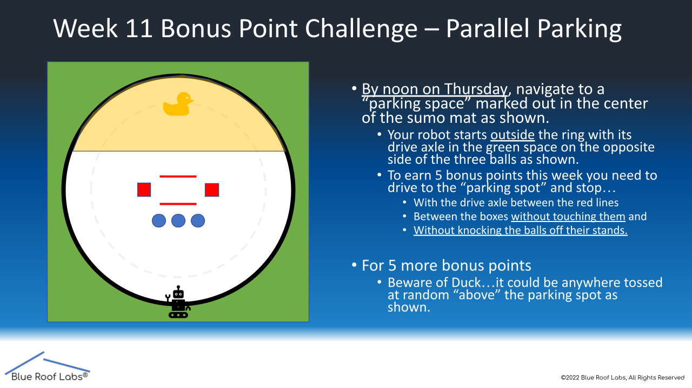

## About This GitHub
This is a CS capstone project made for the AI class at Bradley University. This GitHub should help students use Webots to test their algorithms in a virtual simulation before testing in real life.

To see more details on how to use Webots, expand one of the following pages.

<details>
 <summary>Webots Setup</summary>
  <ol>
   

 ## GitHub Setup
 
This GitHub is public read-only, meaning any changes will be saved locally. If you are fine with that, clone this GitHub and make changes locally. If you want backups of your files, such as your robot algorithm/code, through Github, you will need to fork this repository.
 
 * In the top right corner of this GitHub, hit the fork button
 * Scroll down and click "Create Fork"
 * When the repository is completed, clone the forked repository to your device


## Webots Setup

Go to the Webot's website [https://cyberbotics.com/](https://cyberbotics.com/) and click the download button.

If you aren't on Windows, click the arrow next to the download button to specify the type of installer you need.

* Run the installer you just downloaded
  * On Windows you might get the "Windows protected your PC" prompt. Click "More info," then "Run anyway"
* Follow the installer instructions
* After installing, uncheck "Launch Webots," then click finish
<br />

If you have trouble installing Webots, let your teacher know as soon as possible.


## Understanding Webots

Let's start by opening a Webots world/simulation.

* In the file explorer, open up the file from this GitHub at "...AI-Robots-Challenges\Webots\worlds\moose_demo.wbt"
* When opening Webots for the first time, choose which theme you like, and press "Start Webots with the selected theme"
* Close out of the guided tutorial window
<br />

The world you opened up is one of Webot's demo worlds. In this world, the robot moves back and forth, hitting certain checkpoints. In order to explore and understand what is in this world, you will need to move the scene camera.

* To rotate the camera, hold left-click while moving your mouse inside the simulation window
* To move the camera, hold right-click while moving your mouse inside the simulation window
<br />

After practicing moving the camera, let's look at other ways to control the simulation.

* Above the simulation window, you'll see a bunch of icons. You can see what they do by hovering over them
* The most useful button is the pause/play simulation button. Click the pause button between all the arrows to pause the simulation
* To the left of that, click the |<< button or the reset simulation button
  * If the simulation was paused before you reset it, it will stay paused until you press play again
<br />

To the left of the simulation, you have all your objects, and to the right, you have the built-in text editor for your robot. In the next section, where you are moving the robot, we will cover how to use them.


---

 </ol>
</details>


<details>
  <summary>First Challenge</summary>
  <ol>
 
## Open Webots
 
You will be coding the first (week 10) challenge in the virtual world
 
* In the file explorer open up the file from this GitHub at ...AI-Robots-Challenges\Webots\worlds\FirstChallenge.wbt

## Understanding Nodes (Optional)
 
If you want to understand how Webots works, you will need to understand the node system. Nodes are shown in the left window, and nodes work both as objects and as variables. To understand it better, let's make a box.
 

 
* Click the Add Node button (+). Inside the Base Nodes dropdown, select "solid" and click "Add"
* When selecting the Solid "solid" object you just added, click and drag the object so that it isn't inside the robot
* Inside the Solid "solid" object dropdown, double-click on the "children" node or right-click->Add New to add a node to the solid
* Inside the Base Nodes dropdown, select the "Shape" node, and click "Add"
<br />

Objects, such as robots and boxes, in Webots are nodes. The children of those nodes are the properties of the parent nodes. Now that we have a solid object, let's specify what kind of shape it is by changing the properties.
 
* Inside the Shape dropdown, add a node to the "geometry" node by double-clicking it and selecting "Box" under the Base Nodes dropdown
* Inside the geometry box, select "size", and set the size values to .25m in all X, Y, and Z variables
* Add a node to the "appearance" by double-clicking it and selecting "Appearance" under the Base Nodes dropdown
* Inside the appearance dropdown, double-click the "material" node and add the "Material" node
* Inside the material dropdown, change the diffuse color to whatever color you'd like by changing RGB values or using the color picker
<br />

By making this cube, you should understand the basics of Webots' node system (sub-nodes, variables, etc). There is more to making this object physically simulated (adding physics and specifying the bounding object as a box), but this is all you need to know. Now let's reset the simulation so there isn't a random box by pressing the |<< button.

 
 ## Coding the Robot
 
Let's start coding using the built-in IDE on the right window.
 
The way Webots programming works is you get a reference to each motor of the robot through code and then you tell that motor what to do. Those motors will continuously do that until given a new command. Webots lets you wait time as a function in the code, so you don't need to constantly tell the motor what you want it to do.
 
If you look at the code, you can see that I made the functions move_forward(), move_back(), turn_left(), and turn_right() which tell the motors to rotate respectively. Let's use these functions to write a robot that moves forward. The robot AI starts on line 65.
 
* On line 66, the robot only waits one step, which isn't enough to move forward. Let's change that to 25 steps by changing the line to
```sh
robot.step(time_step * 25)
```
* Save the code by pressing Ctr+S or hitting the save button on the top
* Hit the |<< button to reset the simulation and try your new code
  * When the simulation reloads, make sure you are in play mode by pressing the > button on the top. If you are not, then you won't see your robot move
<br />
 

 
Now that know the basics for coding, try the week 10 bonus point challenge where you move the robot in a forward square then make it go backward landing on the starting placement.
 


 
 ---
 
</ol>
</details>

<details>
  <summary>Subsequent Challenges</summary>
  <ol>

## Additional mechanics

For more realism, each simulation will move objects a random amount within an acceptable amount for the challenge.

Once you've completed the challenge, if there is extra credit, you can move Evil Duck onto an acceptable area, and save the simulation by pressing Ctr+Shift+S or the save icon on the top left.

## Coding the camera

* In the file explorer open up the file from this GitHub at ...AI-Robots-Challenges\Webots\worlds\SecondChallenge.wbt
<br />

Since the previous challenge, more functions have been added. DriveForward(angle) drives the robot at an angle. TurnCameraUp()/TurnCameraDown() turns the camera. These functions aren't necessary but are useful.

The AI starts on line 83, with a while loop that prints the RGB of the center bottom pixel on the camera. This is done by imageGetColor(Image, width, x, y) function. You can change the X and Y of the function from what was previously written to change which pixel the camera is looking at. Additionally, you can see the camera video in the top left corner of the simulation window.



Now try the parallel parking challenge


---
 </ol>
</details>