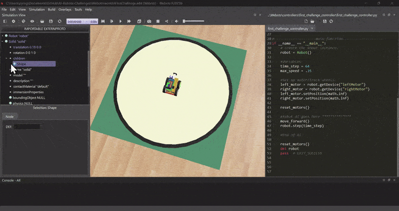
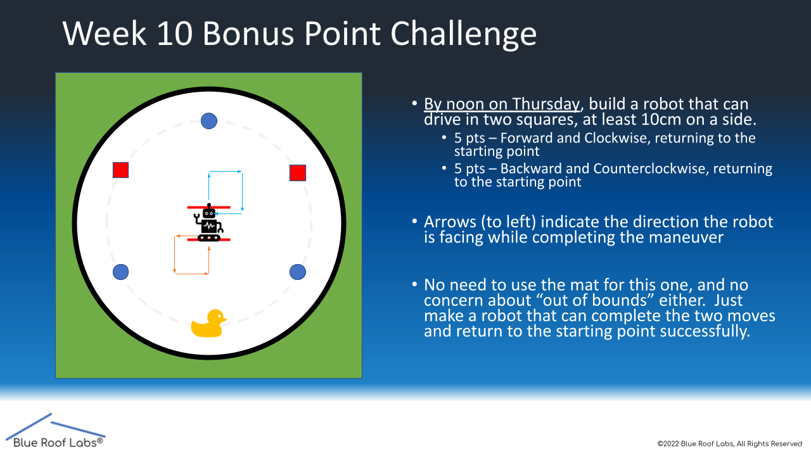

## About The Project
This is a CS capstone project that is currently designing a new robot for your AI class. We need help getting feedback on the usefulness of the virtual robot, so getting that feedback from current students will help future students.

Your task this week will be to code and run the first (week 10) challenge in the virtual world

## GitHub Setup

This week, and from now on you will be editing files, so I assume you want to keep them. Therefore, fork this repository.

* In the top right corner of this GitHub, hit the fork button
* Scroll down and click Create Fork
* When the respotory is completed, clone the forked respotory to your device

Now that GitHub is set up, let's open up the Webots world

* In the file explorer open up the file from this GitHub at ...AI-Robots-Capstone\Webots\worlds\FirstChallenge.wbt

## Make a Box (Optional)

If you want to understand how Webots works, you will need to understand the node system. Nodes are shown in the left window, and nodes work both as objects and as variables. To understand it better, let's make a box.


* Click the Add Node button (+). Inside the Base Nodes dropdown, select solid and click Add
* When selecting the Solid "solid" object you just added, click and drag the object so that it isn't inside the robot
* Inside the Solid "solid" object dropdown, double-click on the children node or right-click->Add New to add a node to the solid
* Inside the Base Nodes dropdown, select the shape node, and click Add

Objects, such as robots and boxes, in Webots are nodes. The children of those nodes are the properties of the parent nodes. Now that we have a solid object, let's specify what kind of shape it is by changing the properties.

* Inside the Shape dropdown, add a node to the Geometry node by double-clicking and select Box under Base Nodes
* Inside the geometry box, select size, and set the size values to .25m in X, Y, and Z
* Add a node to the appearance by double-clicking and select appearance under Base Nodes
* Inside the appearance dropdown, double-click the material and add the material
* Change the diffuse color to whatever color you like

By making this cube, you should understand the basics of Webots' node system. There is more to making this object physically simulated (adding physics and specifying the bounding object as a box), but this is all you need to know. Now let's reset the simulation so there isn't a random box by pressing the |<< button.

## Coding the Robot

Let's start coding using the built-in IDE on the right window.

The way Webots programming works is you get a reference to each motor of the robot through code and then you tell that motor what to do. Those motors will continuously do that until given a new command. Webots lets you wait time as a function in the code, so you don't need to constantly tell the motor what you want it to do.

If you look at the code, you can see that I made the functions MoveForward(), MoveBack(), TurnLeft(), and TurnRight() which tell the motors to rotate respectivly. Let's use these functions to write a robot that moves forward. The robot AI starts on line 75.

* On line 77, the robot only waits one step, which isn't enough to move forward. Let's change that to 25 steps by changing the line to
```sh
robot->step(TIME_STEP*25);
```
* To compile the code, first remove the previous build, and press the top right button that looks like a comb (see GIF)
* After it's completed, hit the gear icon next to it to build your code
* Once completed, you will be asked if you want to reload or reset, hit reload
  * If you changed something in the world, you will be asked if you want to save, hit discard. If you don't see the popup
  * When the simulation reloads, make sure you are in play mode by pressing the > button on the top. If you are not, then you won't see your robot move



Now that know the basics for coding, try the week 10 bonus point challenge where you move the robot in a forward square then make it go backward landing on the starting placement.



It you cannot complete the bonus point challenge because it's too confusing or hard, fill out the form and explain why.

## Task

Once you've completed (or were unable to complete) the first challenge, please fill out this Google form [https://forms.gle/rBniEH7UuqJXANCg7](https://forms.gle/rBniEH7UuqJXANCg7). It will take 5-10 minutes to fill out. 
